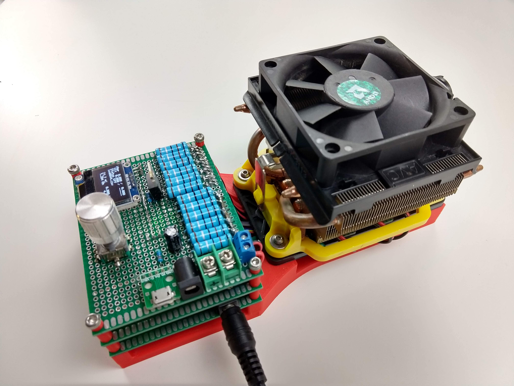

# Arduino DIY: constant current electronic dummy load 

# Absolute Maximum Ratings

* Maximum Input Load Voltage - 25V
* Maximum Input Load Current - 16A
* Maximum Input Power Dissapation - 120W
* Power Source - 12V power addapter
* Minimum load current draw - 50mA
* Constant current resolution - 1mA
* Current reading error (limited by INA219 ADC resolution) - 5mA
* Voltage reading error (limited by INA219 ADC resolution) - 5mV

# Features

* Doesn't require PCB manufacturing and can be assembled on a perf board
* Multi layer stacked design to reduce the circuit size
* Using prebuilt Arduino modules reduces assemble effort
* Bright OLED display with intuitive user interface
* Writes discharge current and voltage values into microSD card
* Fully customizable

# Part list
1. 12V fan with a heat sink. It should have PWM speed control function. I used stock CPU fan from AMD FX-8350 processor as it was laying in a junk box for a long time after I installed water cooling to my desctop PC.
2. CPU cooling Fan Holder for AMD AM3. Bought on [Aliexpress](https://www.aliexpress.com/wholesale?catId=0&initiative_id=SB_20191123235526&origin=y&SearchText=+CPU+cooling+Fan+Holder+for+AMD+AM3).
3. Resistor 0.1R 3W - 12 pices. [Aliexpress](https://www.aliexpress.com/wholesale?catId=0&initiative_id=SB_20191124000008&SearchText=Resistor+0.1+3W)
4. Arduino nano. [Aliexpress](https://www.aliexpress.com/wholesale?catId=0&initiative_id=SB_20191124000043&SearchText=Arduino+nano)
5. Electrolytic capacitors 470uf and 47uf (2 pcs)
6. High current logic level N-Channel mosfet. I used IRF1404 (7 pcs) as it have ultra low On-Resistance.
7. Logic level mosfet to switch on and off the fan. I used AO3400 with a SOT23-to-DIP adapter PCB.
8. Male, female and 90-degree bended pin headers.
9. Rotary encoder.
10. SSD1306 LCD display
11. Diode to restrict reverse current coming from the fan. I belive pretty much any will work. I used M1 smd diode. But through-hole will also fit.
12. INA219 module will measure voltage and current.
13. MicroSD card module.
14. Some 2mm duck tape to palce as a buffer between perboard and arduino modules.
15. LM385P dual operational amplifier (3 pcs) and hole female header
16. Bunch of 1/4W through-hole resistors.
17. 7x9 cm perfboard (4 pcs)
18. Thermal conductive paste or tape.
19. Wire.
20. Connectors KF7.62, KF301-5.0-2P, 5.5x2.1mm Female DC Power Jack, 
21. 1kOm potentiometer.
22. 40mm M3 screw (4 pcs).
23. I used thermistor to measure heat sink temperature, but LM35 temperature sensor will be the easier solution as it doesn't requere calibration.

# Tools
1. Soldering iron
2. Flux
3. Soldering wire
4. Multimeter

# Assembly instructions

# Design justification

## 12V power supply
12V power supply is less convinient than 5V but there are several reasons why it was used. First of all LM385 operational amplifier shows more stable work when powered from 12V. Also it allows to use much bigger variety of N-channel MOSFET as a heat element with a gate voltage hight than 5V and not to be bound to logic level MOSFET. The other reason is that PC fans work from 12v.

## 120W is not enough
Current design utilize 6 cascades. Each cascade includes opperational amplifier, 0R1 resistor and n-channel MOSFET. Cheap low-quality MOSFETs from Aliexpress can handle about 20W. You can get better MOSFET transistor or add more cascades. Feel free to extend the design.

